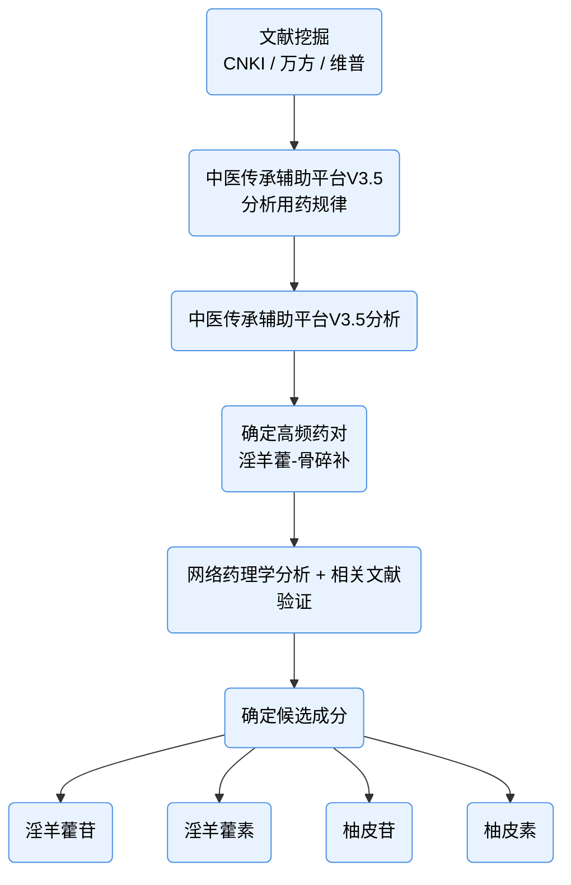

```mermaid
graph TD

A1(文献挖掘<br/>CNKI / 万方 / 维普) --> A2(中医传承辅助平台V3.5<br/>分析用药规律)
A2 --> A3(中医传承辅助平台V3.5分析)
A3 --> A4(确定高频药对<br/>淫羊藿-骨碎补)
A4 --> A5(网络药理学分析 + 相关文献验证)
A5 --> A6(确定候选成分)
A6 --> A71(淫羊藿苷)
A6 --> A72(淫羊藿素)
A6 --> A73(柚皮苷)
A6 --> A74(柚皮素)

classDef basis fill:#E8F3FF,stroke:#4A90E2,stroke-width:1px,color:#000;
classDef network fill:#EAF8EF,stroke:#43A047,stroke-width:1px,color:#000;
classDef result fill:#FFECEC,stroke:#E53935,stroke-width:1px,color:#000;

class A1,A2,A3,A4,A5,A6,A71,A72,A73,A74 basis;
class B1,B2,B3,B4,B5,B6 network;
class C1,C2,C3 result;
  
```