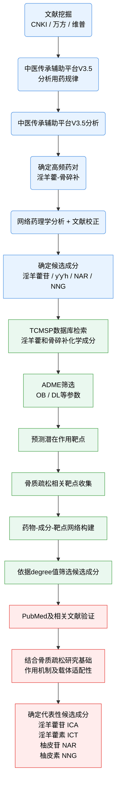

```mermaid
graph TD

A1(文献挖掘<br/>CNKI / 万方 / 维普) --> A2(中医传承辅助平台V3.5<br/>分析用药规律)
A2 --> A3(中医传承辅助平台V3.5分析)
A3 --> A4(确定高频药对<br/>淫羊藿-骨碎补)
A4 --> A5(网络药理学分析 + 文献校正)
A5 --> A6[确定候选成分<br/>淫羊藿苷 / y'y'h / NAR / NNG]

A6 --> B1[TCMSP数据库检索<br/>淫羊藿和骨碎补化学成分]
B1 --> B2[ADME筛选<br/>OB / DL等参数]
B2 --> B3[预测潜在作用靶点]
B3 --> B4[骨质疏松相关靶点收集]
B4 --> B5[药物-成分-靶点网络构建]
B5 --> B6[依据degree值筛选候选成分]

B6 --> C1[PubMed及相关文献验证]
C1 --> C2[结合骨质疏松研究基础<br/>作用机制及载体适配性]
C2 --> C3[确定代表性候选成分<br/>淫羊藿苷 ICA<br/>淫羊藿素 ICT<br/>柚皮苷 NAR<br/>柚皮素 NNG]

classDef basis fill:#E8F3FF,stroke:#4A90E2,stroke-width:1px,color:#000;
classDef network fill:#EAF8EF,stroke:#43A047,stroke-width:1px,color:#000;
classDef result fill:#FFECEC,stroke:#E53935,stroke-width:1px,color:#000;

class A1,A2,A3,A4,A5,A6 basis;
class B1,B2,B3,B4,B5,B6 network;
class C1,C2,C3 result;
  
```