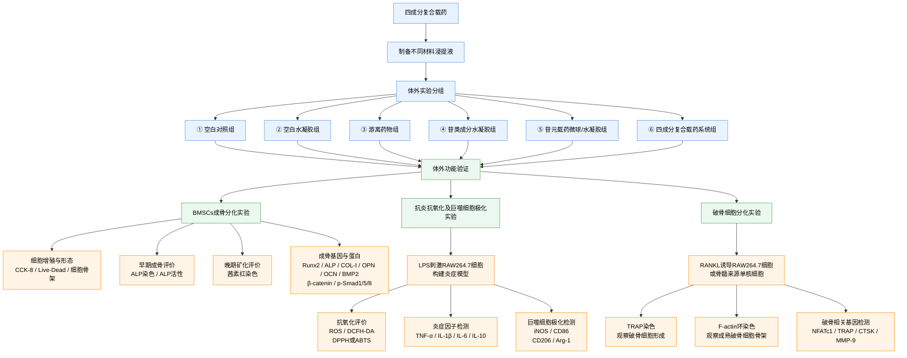

```mermaid
graph TD

A[四成分复合载药] --> B[制备不同材料浸提液]

B --> C[体外实验分组]

C --> C1[① 空白对照组]
C --> C2[② 空白水凝胶组]
C --> C3[③ 游离药物组]
C --> C4[④ 苷类成分水凝胶组]
C --> C5[⑤ 苷元载药微球/水凝胶组]
C --> C6[⑥ 四成分复合载药系统组]

C1 --> D[体外功能验证]
C2 --> D
C3 --> D
C4 --> D
C5 --> D
C6 --> D

D --> E1[BMSCs成骨分化实验]
E1 --> E11[细胞增殖与形态<br/>CCK-8 / Live-Dead / 细胞骨架]
E1 --> E12[早期成骨评价<br/>ALP染色 / ALP活性]
E1 --> E13[晚期矿化评价<br/>茜素红染色]
E1 --> E14[成骨基因与蛋白<br/>Runx2 / ALP / COL-I / OPN / OCN / BMP2<br/>β-catenin / p-Smad1/5/8]

D --> F1[抗炎抗氧化及巨噬细胞极化实验]
F1 --> F11[LPS刺激RAW264.7细胞<br/>构建炎症模型]
F11 --> F12[抗氧化评价<br/>ROS / DCFH-DA<br/>DPPH或ABTS]
F11 --> F13[炎症因子检测<br/>TNF-α / IL-1β / IL-6 / IL-10]
F11 --> F14[巨噬细胞极化检测<br/>iNOS / CD86<br/>CD206 / Arg-1]

D --> G1[破骨细胞分化实验]
G1 --> G11[RANKL诱导RAW264.7细胞<br/>或骨髓来源单核细胞]
G11 --> G12[TRAP染色<br/>观察破骨细胞形成]
G11 --> G13[F-actin环染色<br/>观察成熟破骨细胞骨架]
G11 --> G14[破骨相关基因检测<br/>NFATc1 / TRAP / CTSK / MMP-9]


classDef group fill:#E8F3FF,stroke:#4A90E2,stroke-width:1px,color:#000;
classDef vitro fill:#EAF8EF,stroke:#43A047,stroke-width:1px,color:#000;
classDef assay fill:#FFF4E5,stroke:#FB8C00,stroke-width:1px,color:#000;
classDef result fill:#FFECEC,stroke:#E53935,stroke-width:1px,color:#000;

class A,B,C,C1,C2,C3,C4,C5,C6 group;
class D,E1,F1,G1 vitro;
class E11,E12,E13,E14,F11,F12,F13,F14,G11,G12,G13,G14 assay;
class H,I result;
```