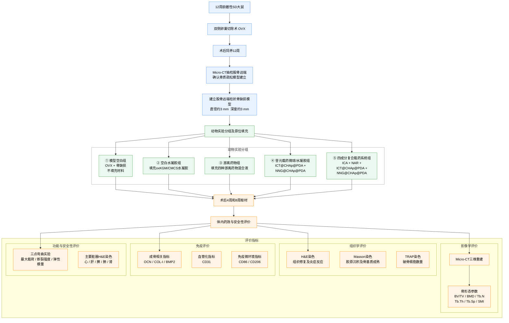

```mermaid
%%{init: {'flowchart': {'curve': 'linear'}}}%%
flowchart TB

A[12周龄雌性SD大鼠] --> B[双侧卵巢切除术 OVX]
B --> C[术后饲养12周]
C --> D[Micro-CT抽检股骨远端<br/>确认骨质疏松模型建立]
D --> E[建立股骨远端柱状骨缺损模型<br/>直径约3 mm  深度约3 mm]
E --> F[动物实验分组及原位填充]

subgraph GROUP[动物实验分组]
direction LR
G1[① 模型空白组<br/>OVX + 骨缺损<br/>不填充材料]
G2[② 空白水凝胶组<br/>填充oxKGM/CMCS水凝胶]
G3[③ 游离药物组<br/>填充四种游离药物混合液]
G4[④ 苷元载药微球/水凝胶组<br/>ICT@CHAp@PDA +<br/>NNG@CHAp@PDA]
G5[⑤ 四成分复合载药系统组<br/>ICA + NAR +<br/>ICT@CHAp@PDA +<br/>NNG@CHAp@PDA]
end

F --> G1
F --> G2
F --> G3
F --> G4
F --> G5

G1 --> H[术后4周和8周取材]
G2 --> H
G3 --> H
G4 --> H
G5 --> H

H --> I[体内药效与安全性评价]

subgraph EVAL[评价指标]
direction LR

subgraph E1[影像学评价]
direction TB
I1[Micro-CT三维重建]
I2[骨形态参数<br/>BV/TV / BMD / Tb.N<br/>Tb.Th / Tb.Sp / SMI]
I1 --> I2
end

subgraph E2[组织学评价]
direction TB
J1[H&E染色<br/>组织修复及炎症反应]
J2[Masson染色<br/>胶原沉积及骨基质成熟]
J3[TRAP染色<br/>破骨细胞数量]
end

subgraph E3[免疫评价]
direction TB
K1[成骨相关指标<br/>OCN / COL-I / BMP2]
K2[血管化指标<br/>CD31]
K3[免疫微环境指标<br/>CD86 / CD206]
end

subgraph E4[功能与安全性评价]
direction TB
L1[三点弯曲实验<br/>最大载荷 / 断裂强度 / 弹性模量]
L2[主要脏器H&E染色<br/>心 / 肝 / 脾 / 肺 / 肾]
end

end

I --> I1
I --> J1
I --> K1
I --> L1


classDef model fill:#E8F3FF,stroke:#4A90E2,stroke-width:1px,color:#000;
classDef group fill:#EAF8EF,stroke:#43A047,stroke-width:1px,color:#000;
classDef assay fill:#FFF4E5,stroke:#FB8C00,stroke-width:1px,color:#000;
classDef result fill:#FFECEC,stroke:#E53935,stroke-width:1px,color:#000;

class A,B,C,D,E model;
class F,G1,G2,G3,G4,G5 group;
class H,I,I1,I2,J1,J2,J3,K1,K2,K3,L1,L2 assay;
class M,N,O result;

style GROUP fill:transparent,stroke:#999,stroke-width:1px
```