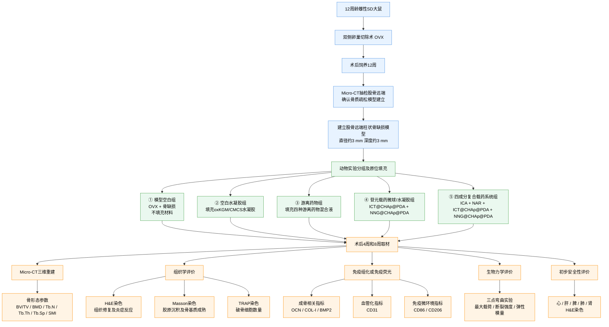

```mermaid
graph TD

A[12周龄雌性SD大鼠] --> B[双侧卵巢切除术 OVX]
B --> C[术后饲养12周]
C --> D[Micro-CT抽检股骨远端<br/>确认骨质疏松模型建立]
D --> E[建立股骨远端柱状骨缺损模型<br/>直径约3 mm 深度约3 mm]

E --> F[动物实验分组及原位填充]

F --> F1[① 模型空白组<br/>OVX + 骨缺损<br/>不填充材料]
F --> F2[② 空白水凝胶组<br/>填充oxKGM/CMCS水凝胶]
F --> F3[③ 游离药物组<br/>填充四种游离药物混合液]
F --> F4[④ 苷元载药微球/水凝胶组<br/>ICT@CHAp@PDA + NNG@CHAp@PDA]
F --> F5[⑤ 四成分复合载药系统组<br/>ICA + NAR + ICT@CHAp@PDA + NNG@CHAp@PDA]

F1 --> G[术后4周和8周取材]
F2 --> G
F3 --> G
F4 --> G
F5 --> G

G --> H1[Micro-CT三维重建]
H1 --> H11[骨形态参数<br/>BV/TV / BMD / Tb.N / Tb.Th / Tb.Sp / SMI]

G --> H2[组织学评价]
H2 --> H21[H&E染色<br/>组织修复及炎症反应]
H2 --> H22[Masson染色<br/>胶原沉积及骨基质成熟]
H2 --> H23[TRAP染色<br/>破骨细胞数量]

G --> H3[免疫组化或免疫荧光]
H3 --> H31[成骨相关指标<br/>OCN / COL-I / BMP2]
H3 --> H32[血管化指标<br/>CD31]
H3 --> H33[免疫微环境指标<br/>CD86 / CD206]

G --> H4[生物力学评价]
H4 --> H41[三点弯曲实验<br/>最大载荷 / 断裂强度 / 弹性模量]

G --> H5[初步安全性评价]
H5 --> H51[心 / 肝 / 脾 / 肺 / 肾<br/>H&E染色]


classDef model fill:#E8F3FF,stroke:#4A90E2,stroke-width:1px,color:#000;
classDef group fill:#EAF8EF,stroke:#43A047,stroke-width:1px,color:#000;
classDef assay fill:#FFF4E5,stroke:#FB8C00,stroke-width:1px,color:#000;
classDef result fill:#FFECEC,stroke:#E53935,stroke-width:1px,color:#000;

class A,B,C,D,E model;
class F,F1,F2,F3,F4,F5 group;
class G,H1,H11,H2,H21,H22,H23,H3,H31,H32,H33,H4,H41,H5,H51 assay;
class I,J,K result;
  
```